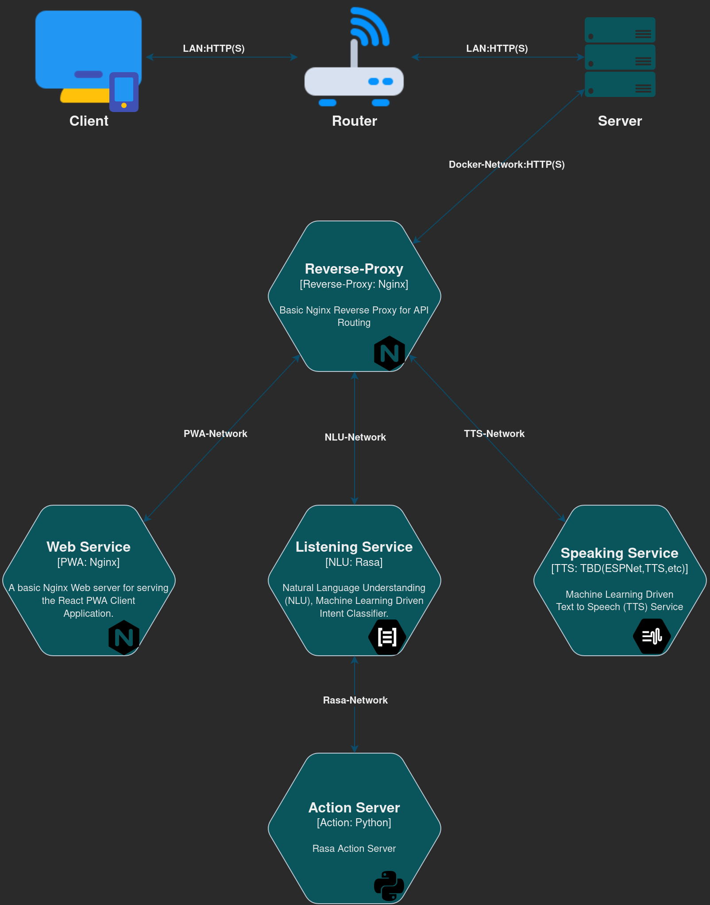

# ナビProject

## Introduction: What is Nabi Project?

Nabi Project is a personal assistant PWA that takes the form of a cute little girl by the name of Nabi.

## Technologies & Concepts

- Progressive Web Application (PWA)
- Single Page Application (SPA)
- Containerized MicroServices (Docker)
- Reverse Proxy (Nginx)

## Network Topology

## Modules

| Module | Category  | Programming Language | Sdk | Docker |
| ------ | --------- | -------------------- | -------- | ------ |
|Reverse Proxy|Support Tool|-|-|[nginx:alpine](https://hub.docker.com/_/nginx)|
|UI-Appearance|Consumer|Javascript|Node/React|[nginx:alpine](https://hub.docker.com/_/nginx)|
|API-Voice|Service|`TBD`|`TBD`|`TBD`|
|API-Brain|Service|`TBD`|`TBD`|`TBD`|

## API by Service

| Brain | Voice |
| ----- | ----- |
| `TBD` | `TBD` |
|  |  |
|  |  |
|  |  |
|  |  |

## Requirements

### UI-Appearance

- Interpret spoken English Queries into text Queries.
- Interpret spoken Japanese Queries into text Queries.
- Display Nabi's Model.
- Directly interact with Nabi's Model.
- Animate Nabi's Model as a query response.
- Lip Sync Nabi's Model to match Nabi's Voice output.

### API-Voice

- Read text out loud with Nabi's unique voice.

### API-Brain

- Respond appropriately to Queries in English.
- Respond appropriately to Queries in Japanese.
- Search the internet using text.
- Search the internet using images.
- Perform machine translation.
- Perform lookups in a JP<->EN dictionary.
- Interact with Gmail/Outlook (client device).
- Interact with Discord (client device).
- Manage SMS Messages (client device).
- Manage Line Messages (client device).
- Set/manage alarms.
- Create/manage reminders.
- Create/manage todo items.

## Running the Project

`TODO (Most likely a DockerCompose File in the /build Directory)`

## Licence

None (Author Use only)

## Author

Alan Holman 2021

<alan@shuruni.dev>
