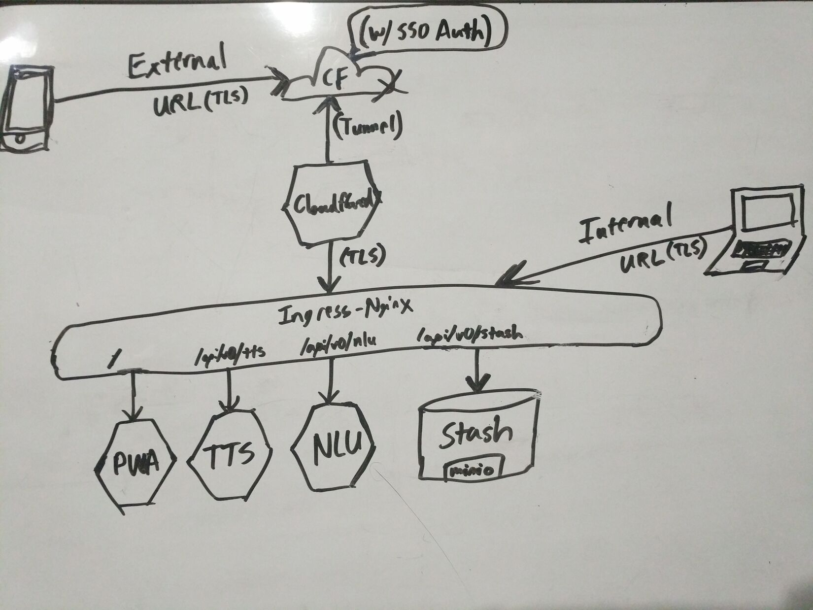

# Nabi Project

## Introduction: What is Nabi Project?

A personal assistant Progressive Web App (PWA) featuring an anime style avatar. The application leverages Natural Language Understanding for parsing user queries, and employs a customized speech model for TTS.

## Design Features

- Microservice Architecture
- Single Page Application (SPA)
- Progressive Web Application (PWA)
- Natural Language Understanding (NLU)
- Deep Learning Text-to-Speech (TTS)

## Technologies

- **Web Development:** [Nginx](https://www.nginx.com/), [React](https://reactjs.org/), [JavaScript](https://www.javascript.com/)
- **Machine Learning:** [Rasa](https://rasa.com/), [ESPnet](https://github.com/espnet/espnet)
- **APIs:** [Flask](https://flask.palletsprojects.com/en/2.0.x/), [Python](https://www.python.org/)
- **Scripting:** [Bash](https://www.gnu.org/software/bash/)
- **Deployment:** [Helm](https://helm.sh/), [Kubernetes](https://kubernetes.io/), [Docker](https://www.docker.com/)
- **External Access:** [Cloudflare Tunnels](https://developers.cloudflare.com/cloudflare-one/connections/connect-apps/)

## Screenshots

|  |  |  |  |
|-|-|-|-|
|  |  |  |  |
|  |  |  |  |

## Modules

| Module | Category  | Programming Language | Sdk | Docker/Helm |
| ------ | --------- | -------------------- | -------- | ------ |
|Nabi-Cloudflared|Utility|-|-|[cloudflared](https://hub.docker.com/r/cloudflare/cloudflared)|
|Nabi-PWA|Service|JavaScript|React|[nginx:alpine](https://hub.docker.com/_/nginx)|
|Nabi-NLU|Service|-|-|[rasa:3.0.2-full](https://hub.docker.com/r/rasa/)|
|Nabi-TTS|Service|Python|Flask, ESPnet|[python:3.9](https://hub.docker.com/_/python/)|
|**`WIP`** Nabi-Stash|Service|-|-|**`WIP`**[Minio:~4.0.9](https://charts.min.io/)|

## API Endpoints by Service

| Nabi-PWA | Nabi-NLU           | Nabi-TTS                       |
| -------- | ------------------ | ------------------------------ |
| GET `/*` | POST `/api/v0/nlu` | POST `/api/v0/tts`             |
|          |                    | GET `/api/v0/tts/<resourceID>` |

| **`WIP`** Nabi-Stash    |
| ------------------- |
| **`WIP`** `/api/v0/stash` |

## Network Topography Diagram

(`WIP`: Need to Create a Proper Non-Whiteboarded Diagram for the updated Design...)

## Requirements

### Web Service

Basic

- [x] Interpret spoken Japanese Queries as text Queries.
- [ ] Display Nabi's Model.
- [ ] Animate Nabi's Model in Response to tap/click.

Requires Listening Service:

- [ ] Animate Nabi's Model (according to message response).

Requires Listening & Speaking Services

- [ ] Lip Sync Nabi's Model to match Nabi's Voice output.
- [ ] Play Pre-Generated Voice Clip in Response to tap/click

### Speaking Service

Basic

- [x] Read text out loud with Nabi's unique voice.

### Listening Service

Basic

- [x] Respond appropriately to Queries in Japanese.

Ideas

- [ ] Integrate with Discord.

### Action Server

Basic

- [x] Perform minor Chit-chat
- [ ] Search the internet using text.
- [ ] Perform machine translation.
- [ ] Perform lookups in a JP<->EN dictionary.
- [ ] Set/manage alarms.
- [ ] Create/manage reminders.
- [ ] Create/manage todo items.

Ideas

- [ ] Search the internet using images.
- [ ] Manage Email.
- [ ] Manage SMS Messages (client device).

## Deploying the Project

*Note: While a previous version of the repo utilized Docker and Docker-Compose in order to deploy the application, this approach lacked the flexibility and scalability that was beginning to become necessary to proceed with further additions to the project (primarily on the Machine Learning Front). As a result, support for docker-compose based deployments has been dropped for the forseeable future.*

Nabi Project is deployed through the use of a Helm Chart and a few Helper Scripts. The deploy target in mind when developing the underlying helm chart and deploy scripts is my On-Prem Kubernetes Cluster. As a result, adaptations would likely need to be made if deploying to a K8s Cluster configured differently, though for the most part, the Helm Charts I have constructed allow for a sufficient amount of configurability that this should not pose too much of a challenge.

### Testing Environment (Namespace) Deploy

- The Testing Environment is comprised purely of each of the Component Helm Charts Individually Deployed.
- As a result, The Top Level Helm Chart maintained in this Top Level Repository is not intended to be deployed to the testing environment.
- Additionally, the testing environment does not make use of the following charts:
  - ingress-nginx
    - Instead Ingress Resources are served by an existing general use Ingress Controller in the Cluster.
  - nabi-cloudflared
    - The Testing Environment purely internal and is not meant to be used off the local network.
- Please Reference each individual Submodule Repository for details on how to deploy each chart individually.

### Staging Environment Deploy

- The Staging Environment is designed to check that both internal and external connections to a deployment configuration that is known to work in the testing environment are valid before releasing to the Production Environment.
- Deployment to the Staging Environment can be done by running the [Staging Environment Deploy Script](/scripts/staging/3-deploy.sh) in the [Staging Scripts Directory](/scripts/staging) in this Repo.

### Production Environment Deploy

- After verifying a deployment in the Staging Environment is ready for release, it is time to roll out a new release in the Production Environment.
- The first step to doing this is to **Package** the Working Helm Chart and **Push** it to the Internal Registry. This can be done by Running the [Package And Push Helper Script](/scripts/package-and-push-chart.sh) in the [Scripts Directory](/scripts) in this Repo.
- After you have successfully packaged and pushed the update to the Helm Chart, simply Bump up the version to deploy in the [Production Environment Deploy Script](/scripts/production/3-deploy.sh) and Run it in the [Production Scripts Directory](/scripts/production) in this Repo.

## License

None (Author Use only)

## Author

[Alan Holman](mailto:alan@shuruni.dev)
