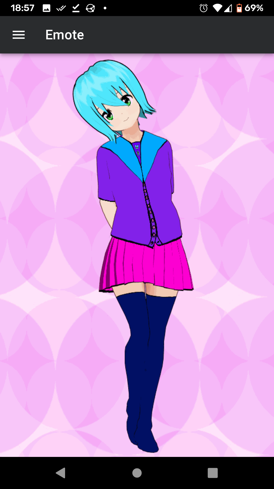
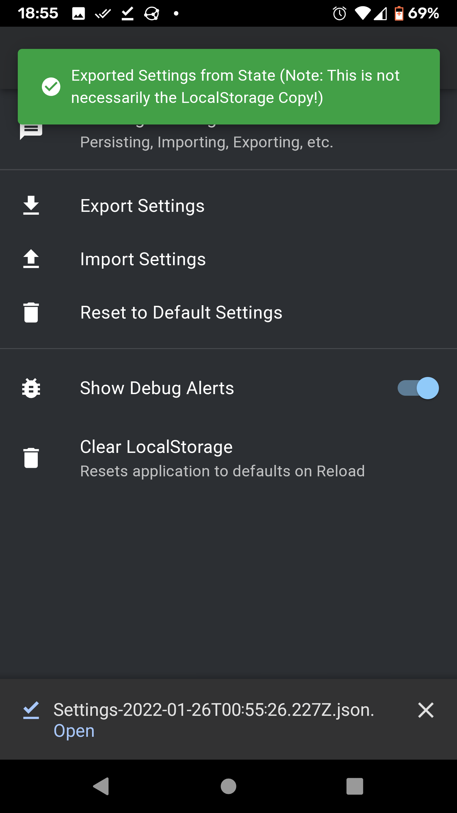
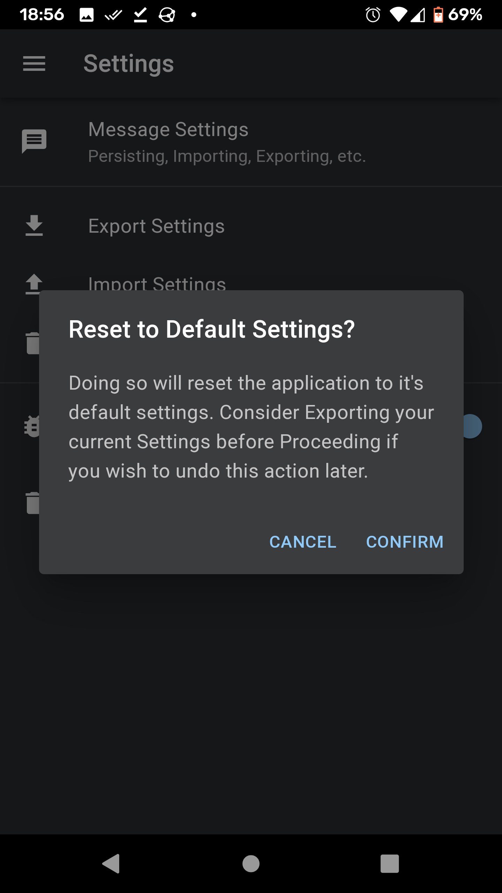

# Nabi Project

## Introduction: What is Nabi Project?

A personal assistant Progressive Web App (PWA) featuring an anime style avatar. The application leverages Natural Language Understanding for parsing user queries, and employs a customized speech model for TTS.

## Design Features

- Microservice Architecture
- Single Page Application (SPA)
- Progressive Web Application (PWA)
- Natural Language Understanding (NLU)
- Deep Learning Text-to-Speech (TTS)

## Technologies

- **Web Development:** [Nginx](https://www.nginx.com/), [React](https://reactjs.org/), [JavaScript](https://www.javascript.com/), [Vite](https://vitejs.dev/)
- **Machine Learning:** [Rasa](https://rasa.com/), [ESPnet](https://github.com/espnet/espnet)
- **Backend APIs:** [Flask](https://flask.palletsprojects.com/en/2.0.x/), [Python](https://www.python.org/)
- **DevOps(CI/CD):** [Jenkins](https://www.jenkins.io/), [Gitea](https://about.gitea.com/), [Bash](https://www.gnu.org/software/bash/), [Helm](https://helm.sh/), [Kubernetes](https://kubernetes.io/), [Docker](https://www.docker.com/)
- **External Networking:** [CloudflareTunnels](https://developers.cloudflare.com/cloudflare-one/connections/connect-apps/)

## Screenshots

|  |  |  |  |
|-|-|-|-|
|  |  |  |  |
|  |  |  |  |

## Modules

| Module | Category  | Programming Language | Sdk | Docker/Helm |
| ------ | --------- | -------------------- | -------- | ------ |
|Nabi-Cloudflared|Utility|-|-|[cloudflared](https://hub.docker.com/r/cloudflare/cloudflared)|
|Nabi-PWA|Service|JavaScript|React|[nginx:alpine](https://hub.docker.com/_/nginx)|
|Nabi-NLU|Service|-|-|[rasa:3.0.2-full](https://hub.docker.com/r/rasa/)|
|Nabi-TTS|Service|Python|Flask, ESPnet|[python:3.9](https://hub.docker.com/_/python/)|

## API Endpoints by Service

| Nabi-PWA | Nabi-NLU           | Nabi-TTS                       |
| -------- | ------------------ | ------------------------------ |
| GET `/*` | POST `/api/v0/nlu` | POST `/api/v0/tts`             |
|          |                    | GET `/api/v0/tts/<resourceID>` |

## Objectives

### Initial Goals

#### Interaction

- [x] ~~Interpret spoken Japanese Queries as text Queries.~~ (This is possible using just normal on-device assistive tech so no need to add ASR ofc)
- [x] Read text out loud with Nabi's "unique" voice.
- [x] Respond appropriately to Queries in Japanese.

#### Actions

- [x] Perform minor Chit-chat (`TODO`: Integrate with LLM for more varied conversation)
- [x] Insert Furigana Readings on words/sentences upon request (See [kuroshiro-browser](https://github.com/Shuruni/kuroshiro-browser) for how I did this)
- [ ] Perform machine translation.
- [ ] Set/manage alarms.
- [ ] Create/manage reminders.
- [ ] Create/manage todo items.

### Eventual Goals

#### Aesthetics (3D Model Viewer)

- [ ] Display Nabi's Model.
- [ ] Animate Nabi's Model in Response to tap/click.
- [ ] Animate Nabi's Model (according to message response).
- [ ] Lip Sync Nabi's Model to match Nabi's Voice output.
- [ ] Play Voice in Response to tap/click

#### Integrations

- [ ] Integrate with Discord/IRC/RCS/Email/etc.
- [ ] Search the internet using text.
- [ ] Search the internet using images.

## Deploying the Project

*Note: While a previous version of Nabi Project utilized Docker and Docker-Compose in order to deploy the application, this approach lacked the flexibility and scalability that was beginning to become necessary to proceed with further additions to the project (primarily on the Machine Learning Front). As a result, support for docker-compose based deployments has been dropped in favor of a Helm Chart based Deployment to K8s.*

Nabi Project is deployed through the use of a Helm Chart and a few Helper Scripts. The deploy target in mind when developing the underlying helm chart and deploy scripts is my On-Prem Kubernetes Cluster. As a result, adaptations would likely need to be made if deploying to a K8s Cluster configured differently, though for the most part, the Helm Charts I have constructed allow for a sufficient amount of configurability that this should not pose too much of a challenge.

### Testing Environment (Namespace) Deploy

- The Testing Environment is comprised purely of each of the Component Helm Charts Individually Deployed.
- As a result, The Top Level Helm Chart maintained in this Repository is not intended to be deployed to the testing environment.
- Additionally, the testing environment does not make use of the following charts:
  - ingress-nginx
    - Instead, Ingress Resources are served by an existing general use Ingress Controller in the Cluster.
  - nabi-cloudflared
    - The Testing Environment is purely internal and is not meant to be used off the local network.
- Please Reference each individual Submodule Repository for details on how to deploy each chart individually.

### Staging Environment Deploy

- The Staging Environment is designed to ensure that releases that are known to work in the testing environment continue to function properly when deployed alongside the charts that handle internal and external connections (i.e. Deployed in an environment similar to Production).
- Currently, the Build and Deployment to staging is defined in [JenkinsFile](/Jenkinsfile) (which references the shared library scripts in the [build](/build/) submodule repo).
- As such, manual deployment outside of the Jenkins Pipeline has not been a high priority, though ultimately it is just a Helm chart and there are some helper scritps left over from previously to help get you pointed in the right direction. For Manual Deployment to the Staging Environment you can reference the [Staging Environment Deploy Script](/scripts/manual_scripts/staging-deploy.sh) in the [Manual Scripts Directory](/scripts/manual_scripts/) in this Repo.

### Production Environment Deploy

- After verifying that a deployment in the Staging Environment is functioning without issue, It should be safe to roll out a new release to the Production Environment.
- As the config for Stating and Prod are going to be very similar with the differences being those that would be values provided at Deploy time, you can consider the same general appoach for Manual deploy of Production as you would for Staging.
- This said, the actual Prod Deployment uses the same JenkinsFile noted here, though unlike Staging which is CI/CD triggered on pushes to Main in this Repo (As Testing Builds are triggered by pushes to main in the submodules), These Pipelines are Triggered After Manual Review with the Prod Keys only provided to Jenkins at that time.

## Background Context

### ***Warning***

*The below section is largely irrelevant and purely present for those who care to know about the journey of a random developer on the internet. Unless you are **really** bored, You can and should just ignore it. (^_^)b*

### Origins

Nabi originally came into existence while I was working on math homework back in highschool, was bored, so tried my hand at drawing a random chibi nekomimi character on a notecard (having only some minor past experience). Surprisingly, this came out WAY better than I could have ever imagined. During this time, I was doing livestreaming of the game Osu, and had recently started working on an IRC Chatbot for my twitch streaming. At the time I didn't have a good name for it, so I called it MareBot (after Mare S. Ephemeral from Hoshizora no Memoria (a favorite of mine at the time)), though when I drew up this new character on a notecard, I decided that I would use her as the main chatbot character. In that moment, I decided on the name "Nabi" because this is literally just the first part of japanese (ナビ)ゲーター(Nabigeetaa->Navigator). From there I noted that that was (obviously) taken, so I did Nabibot (also taken), so did "Nabibot_" (because I was stubborn XD).

### Fun & Games

Over the period of my Senior Year in High School, while Livestreaming, I would regularly work on Nabi and engage in chat with everyone who would come to the stream. From this Nabi's Personality began to emerge. What I had initially intended to be more a cutesy character, while remaining as such, ended up appearing as a bit of a trickster through some of the weird bugs and shenanigans that would show up as I was working on the code.

One of the common happenings that started this was when I introduced a fun !roll command which simply generated a random numbers between 1 and 6 for both nabi and the calling player. If the one for the player was larger, they would win and get a certain number of "coins" from nabi. If they were the same, it was a draw and nothing happened, and if the one for nabi was larger, nabi would take a certain number of coins from the player. Even though it was a simple piece of code that generated 2 random numbers with no bias towards either side, most of the time people would challenge nabi, they would lose and nabi would run off with their coins with a smirk ^w^. this inspired some fan art of nabi running off with a giant bag of coins/money and various other lore surrounding it since it seemed like she had a mind of her own not caring at all about the odds XD.

### Inevitable Turmoil

As time passed, I also tried my hand at getting better and better at drawing in hopes to create the ideal image of nabi that I had in my head. Eventually, I managed to draw a piece that I felt confident in as the definitive reference for nabi. By this time, I was past my senior year and was preparing to head to university. At the beginning, I was able to keep up streaming for a bit longer, though it quickly became apparent that I needed to focus my efforts on keeping up with the curriculum more and so I slowly faded out of doing livestreaming as the curriculum became more rigorous.

This said, while this marked the end of nabi being a livestream chatbot, I still hadn't given up on nabi in general and decided to shift to treating her as a personal assistant character. Though I stopped spending time drawing, I instead occasionally worked on attempting to create a 3D model for nabi using Vroid Studio (all the way from when it was in alpha when I saw つのはねあかぎ do a video on it). During that time, I also Adjusted Nabi's GUI dashboard that I had made for use during streaming to instead play music and do a few other things to aid me personally.

### Advancement

After advancing in university and my internship, I realized just how unmaintainable the Nabibot's code was and decided in my last year of University to make an effort to scrap Nabi's existing code that was intended for use as a chatbot and instead redesign everything from scratch with the new proper development principles that I had learned during my time in university and to the standards of the work and infrastructure that I had used while I was at my internship.

This is what eventually became the first iteration of Nabi-Project.

After University, I had continued working on Nabi-Project for about a year before eventually deciding to put it on hold while waiting for the technology to catch up to my vision (or at least become lest esoteric to implement in a project as at the time LLM APIs were either very closed off or unusably poor, so I instead was utilizing a specialized self hosted NLU model in the backend for user query mapping with manual coded responses).

### Into the Future

More recently in light of the AI boom that had caused massive leaps in the availability and performance of Models that can perform to the level that I was hoping for in my vision, I have resumed development on Nabi-Project with the intention of providing a general personality to Nabi utilizing LLM prompts.

While I believe LLMs to be well suited for use cases focused on natural language comprehension and nuanced formation, I find these kinds of models to be as unreliable as a normal human might be when asked to perform processing tasks that fall outside the realm of purely natural language processing (NLP) and thus will instead maintain a toolset of actions that may be selected based on interpretation of the user query (using natural language), with the output of said actions embedded/interpreted into natural language after processing is completed for presentation to the user.

## License

None (Author Use only...(。-ω-)zzz. . .For now. . . (。ﾟωﾟ) ﾊｯ!)

## Author

[Alan Holman](mailto:alan@shuruni.dev)
