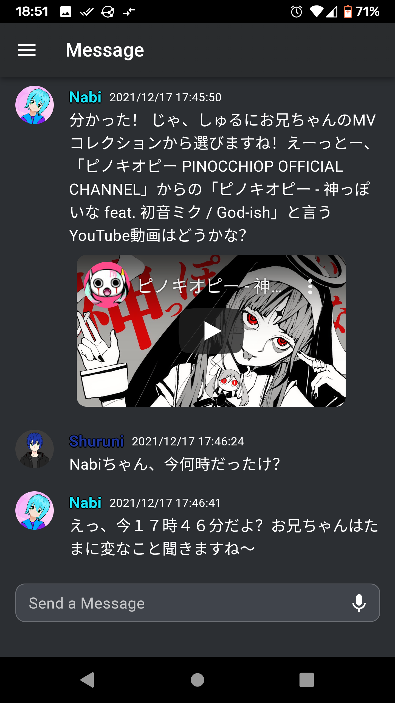
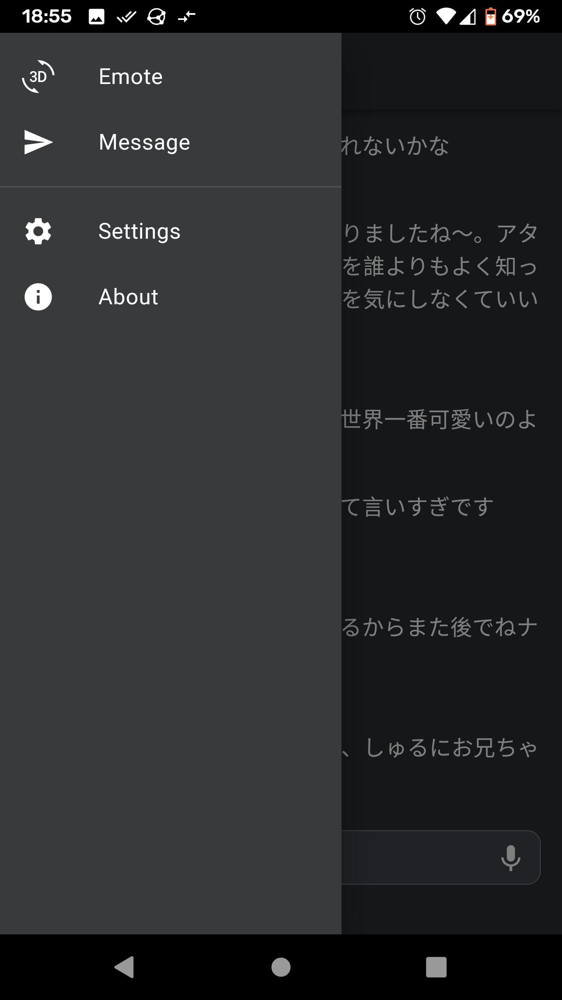

# Nabi Project

## Introduction: What is Nabi Project?

A personal assistant Progressive Web App (PWA) featuring an anime style avatar. The application leverages Natural Language Understanding for parsing user queries, and employs a customized speech model for TTS.

## Concepts

- Argo Tunneling
- Reverse Proxy
- Single Page Application (SPA)
- Progressive Web Application (PWA)
- Microservice Architecture
- Natural Language Understanding (NLU)
- Deep Learning Text-to-Speech (TTS)

## Technologies

- [Docker](https://www.docker.com/), [Cloudflare](https://www.cloudflare.com/), Bash Scripting
- [Nginx](https://www.nginx.com/), [React](https://reactjs.org/), JavaScript
- [Rasa](https://rasa.com/), [ESPnet](https://github.com/espnet/espnet), [Flask](https://flask.palletsprojects.com/en/2.0.x/), Python

## Screenshots

|  |  |  |  |
|-|-|-|-|
|  |  |  |  |
|  |  |  |  |

## Modules

| Module | Category  | Programming Language | Sdk | Docker |
| ------ | --------- | -------------------- | -------- | ------ |
|Tunneling Utility|Support Tool|-|-|[cloudflared](https://hub.docker.com/r/cloudflare/cloudflared)|
|Reverse Proxy|Support Tool|-|-|[nginx:alpine](https://hub.docker.com/_/nginx)|
|Web Service|Service|JavaScript|React|[nginx:alpine](https://hub.docker.com/_/nginx)|
|Listening Service|Service|-|-|[rasa:3.0.2-full](https://hub.docker.com/r/rasa/)|
|Speaking Service|Service|Python|Flask, ESPnet|[python:`TODO`](https://hub.docker.com/_/python/)|
|Action Server|Service Utility|Python|Rasa|[rasa/rasa-sdk:3.0.2](https://hub.docker.com/r/rasa/rasa-sdk)|

## API Endpoints by Service

| Web Service | Listening Service   | Speaking Service   |
| ----------- | ------------------- | ------------------ |
| GET `/*`    | POST `/nabi/listen` | POST `/nabi/speak` |

## Network Topography Diagram

## Requirements

### Web Service

Basic

- [x] Interpret spoken Japanese Queries as text Queries.
- [ ] Display Nabi's Model.
- [ ] Animate Nabi's Model in Response to tap/click.

Requires Listening Service:

- [ ] Animate Nabi's Model (according to message response).

Requires Listening & Speaking Services

- [ ] Lip Sync Nabi's Model to match Nabi's Voice output.
- [ ] Play Pre-Generated Voice Clip in Response to tap/click

### Speaking Service

Basic

- [x] Read text out loud with Nabi's unique voice.

### Listening Service

Basic

- [x] Respond appropriately to Queries in Japanese.

Ideas

- [ ] Integrate with Discord.

### Action Server

Basic

- [x] Perform minor Chit-chat
- [ ] Search the internet using text.
- [ ] Perform machine translation.
- [ ] Perform lookups in a JP<->EN dictionary.
- [ ] Set/manage alarms.
- [ ] Create/manage reminders.
- [ ] Create/manage todo items.

Ideas

- [ ] Search the internet using images.
- [ ] Manage Email.
- [ ] Manage SMS Messages (client device).

## Deploying the Project

INSTALL [docker](https://docs.docker.com/engine/install/) & [docker-compose](https://docs.docker.com/compose/install/) then run the command relevant for your deployment environment.

*In the future it is planned to rework deployment to utilize a helm chart for a scalable Kubernetes deploy as opposed to using docker-compose for a standalone docker deploy.*

### Local Test Deploy

- Run `./deploy.sh run test` in the [scripts](https://github.com/Nabi-Project/scripts) Repo
- Visit at [localhost:8080](http://localhost:8080)

### Development Server Deploy

- Run `./deploy.sh run dev` in the [scripts](https://github.com/Nabi-Project/scripts) Repo
- Visit at [dev.なび.app](https://dev.なび.app)

### Production Server Deploy

- Run `./deploy.sh run prod` in the [scripts](https://github.com/Nabi-Project/scripts) Repo
- Visit at [なび.app](https://なび.app)

## License

None (Author Use only)

## Author

[Alan Holman](mailto:alan@shuruni.dev)
